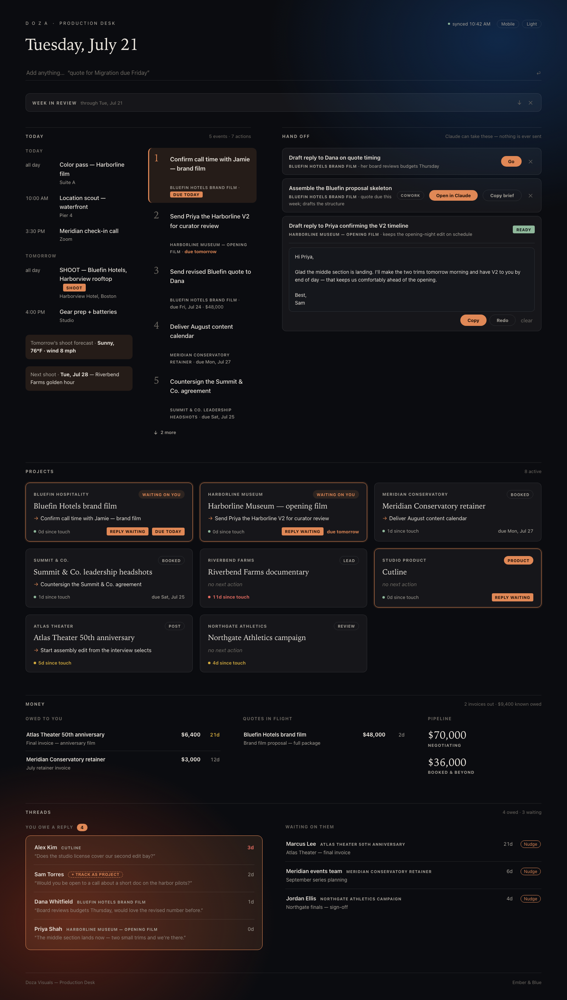

# Doza Production Desk

A self-updating, one-screen production desk for a solo creative studio. It
reads your Gmail and Google Calendar every hour, has Claude classify what
each thread means for your projects, and renders everything you're working
on, negotiating, waiting on, and owed — with zero manual upkeep. Open it,
see your day, close it.

Built by [Doza Visuals](https://www.dozavisuals.com).



*(Screenshot shows fictional demo data — see [Demo mode](#demo-mode).)*

## What it does

- **Today** — your real calendar (shoot days flagged, with a National
  Weather Service forecast), plus your top next actions ranked by deadline,
  money at stake, and staleness.
- **Hand off** — after each refresh, Claude proposes work it can take off
  your plate. Inline drafts (replies, summaries, call prep) run headless and
  land on the dashboard with a Copy button; bigger workflows get a complete
  kickoff brief for Claude Cowork or a chat. Drafts only — nothing is ever
  sent on your behalf.
- **Projects** — one card per project: status, next action, days since last
  touch (amber at 4, red at 7), "waiting on you" highlighted so you can't
  miss it.
- **Money** — invoice aging, quotes in flight, and pipeline totals, derived
  automatically from status signals in your mail.
- **Threads** — who you owe a reply (the whole reason this exists) and who
  owes you one, with one-click nudge drafts.
- **Week in review** — a Friday digest of what moved, what stalled, and
  what's owed.
- Undo on every action, Gmail deep links everywhere, quick-add in plain
  language, dark/light themes, widescreen and mobile layouts.

## Hard rules it's built around

1. **Read-only email and calendar.** `gmail.readonly` + `calendar.readonly`
   scopes only; the app refuses tokens with anything broader.
2. **All data stays local.** SQLite on your machine. The only network calls
   are Google APIs (read), Claude (classification), and the NWS (weather).
3. **The AI never completes tasks.** It suggests; only you mark things done.
4. **Fail quietly.** A failed refresh keeps the last good state on screen.

## Architecture

FastAPI + SQLite (stdlib) serving one vanilla-JS `index.html` at
`localhost:5175`. A `refresh` pipeline fetches Gmail/Calendar, batches new
threads through headless [Claude Code](https://claude.com/claude-code)
(`claude -p`), and writes structured updates. Two launchd jobs keep the
server alive and refresh hourly. No build step, no framework, no cloud.

```
app/        server, schema, config, starter seed
refresh/    fetchers, classifier, delegation scout, digest, weather
static/     the entire frontend (one file)
tools/      demo seeder, SwiftBar menu-bar plugin
scripts/    launchd installer
```

## Setup

Requires macOS, Python 3.11+, a Google account, and the
[Claude Code](https://claude.com/claude-code) CLI (any paid Claude plan).

1. **Clone and run:**
   ```bash
   git clone https://github.com/DozaVisuals/doza-production-desk.git
   cd doza-production-desk
   ./run.sh          # creates venv, installs deps, serves localhost:5175
   ```
   You'll see the dashboard with sample data immediately.

2. **Configure yourself:** `cp config.example.json config.json` and edit —
   your name, studio, a one-line bio (the classifier reads it), how drafts
   should sign off, and your home coordinates for weather.

3. **Google OAuth (one time, ~5 min):** create a project at
   [console.cloud.google.com](https://console.cloud.google.com), enable the
   **Gmail API** and **Google Calendar API**, configure the OAuth consent
   screen (pick *Internal* if you're on Google Workspace; otherwise
   *External* → add yourself as a test user → publish), create an **OAuth
   client ID** of type **Desktop app**, download the JSON to
   `credentials/client_secret.json`, then:
   ```bash
   ./venv/bin/python -m refresh.authorize
   ```

4. **Claude CLI:** make sure `claude` is installed and logged in
   (`claude /login`). Classification runs on your Claude plan.

5. **First sync** (45-day backfill, then inspect):
   ```bash
   ./venv/bin/python -m refresh.fetch --backfill 45
   ./venv/bin/python -m refresh.classify
   ```

6. **Automation:**
   ```bash
   ./scripts/install_automation.sh
   ```
   Installs two launchd agents: server-alive-at-login, and hourly refresh
   7am–8pm (the 7am run re-scans a week for missed replies).

7. **Optional:** a menu-bar reply counter for
   [SwiftBar](https://swiftbar.app) lives in `tools/menubar/`; private
   phone access works great through [Tailscale](https://tailscale.com)
   (`tailscale serve --bg http://localhost:5175`).

## Demo mode

A fully fictional board for screenshots and demos:

```bash
DOZA_DB="$PWD/data/demo.db" ./venv/bin/python tools/demo_seed.py
DOZA_DB="$PWD/data/demo.db" ./venv/bin/python -m uvicorn app.server:app --port 5199
```

## Tuning

The AI's judgment lives in plain-English prompt files:
`refresh/classify_prompt.md` (what's relevant, who owes whom),
`refresh/delegate_prompt.md` (what's worth handing off), and
`refresh/digest_prompt.md`. The waiting-list decay window is `DECAY_DAYS`
in `refresh/classify.py`.

## License

MIT — see [LICENSE](LICENSE).
